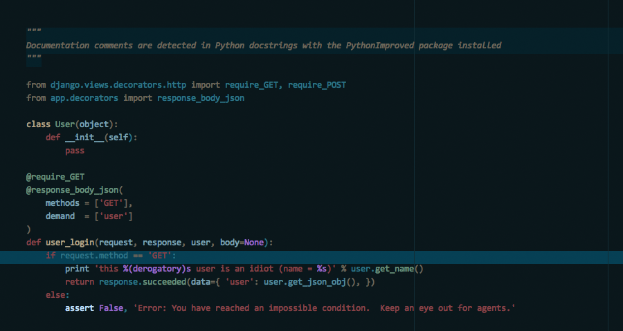

# Aqueducts

A theme for SublimeText 3.

Functions and methods are colored along a yellow-green gradient.  Variables/object-ish things are colored along a blue-white gradient.  That way, you can tell WTF you're looking at easier.  That's the point, right?

There are minor customizations for individual languages that try to smooth over the differences in how syntaxes name their scopes.  Hopefully this'll make for a more consistent experience, but pull requests are welcome if you think it could be improved upon.

##### Python (using the `PythonImproved` package syntax):

##### Javascript / Typescript / JSX / React.js (using the `Babel` package's Javascript syntax):

##### Swift (using a Swift syntax I'm slowly working on but haven't released):

# Authors

bryn austin bellomy < <bryn.bellomy@gmail.com> >

# LICENSE

ISC
